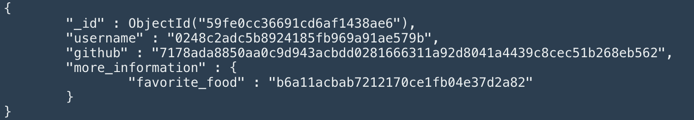

# mongocrypt
### MongoCrypt is an encryption library for node.js

#### An example database entry _without_ MongoCrypt:

#### The same database entry _with_ MongoCrypt:

## Introduction
MongoCrypt is a service to encrypt and decrypt your data stored in a MongoDB database. It was also designed with these principles in mind:

 * __Lightweight:__ With a 20KB index.js it's a pretty lightweight library. No unnecessary functions are included so you can care less about this encryption and concentrate more on you task.
 * __Easy to use:__ It was designed on top of the MongoDB SDK for node.js and it uses almost identical functions. The findOne function compared: 
 ```javascript
    const collection = "users";
    const query = {name: "eykjs"}

    // with mongodb's sdk
    db.collection(collection).findOne(query, (err, res) => {
        if(!err){
            console.log("Email: " + res.email);
        }else{
            console.log("Error!");
        }
    });

    // with mongocrypt
    mongocrypt.db.collection(collection).findOne(query).then(res => {
        if(res){
            console.log("Email: " + res.email);
        }else{
            console.log("Error!");
        }
    });
 ```
 * __Fast & Safe:__ On average mongocrypt is just 5-15ms slower than the MongoDB SDK (depending on the amount and size of your input values) but a lot safer. The data is encrypted by a modern 256-bit AES algorithm (AES-256-CBC by default)

## Installation & Setup
1. Install with npm - mongocrypt will install mongodb automatically after its setup
```sh
npm install mongocrypt
```
2. Require mongocrypt & connect to your database
```javascript
const mongocrypt = require('mongocrypt');
const database_url = "mongodb://yourserver:port/yourdatabase";

mongocrypt.db.connect(url).then(err => {
    if(!err) {
      ...
    }
});
```
## Usage

The mongocrypt functions are based on the MongoDB SDK functions. The structure is always the same. You can see each equivalent in the list below.

**Important before using database functions:**
```javascript
// Be sure you connected to the database
 if(mongocrypt.db.isConnected()){
    // Set the encryption key
    // Important: It has to be a string with the length of 32
        mongocrypt.encryption.set(yourKey);
 }else{
        // have a look at the Installation & Setup section
 }
```

**Equivalents**:
```javascript
// Example values
let query = { username: "eykjs" }
let arrayOfObjects = [{ username: "eykjs" }, {username: "elonmusk" }]
let newobject = {$set: {twitter: "eykjs"}}
let filter = { _id: false } 
let sort = { money: 1 } // asc sort
let options = {sort: sort, filter: filter}

/* INSERT AND UPDATE */


// mongodb.db.collection( collection ).insertOne(object, function(err, res))
 mongocrypt.db.collection(collection).insertOne(object).then(err => {
    if(!err) console.log("Success!");
    if(err) console.log("Error:" + err);
 })

// mongodb.db.collection( collection ).insertMany(arrayOfObjects, function(err, res))
 mongocrypt.db.collection(collection).insertMany(arrayOfObjects).then(err => {
    if(!err) console.log("Success!");
    if(err) console.log("Error:" + err);
 });

// mongodb.db.collection( collection ).updateOne(query, newobject, function(err, res))
 mongocrypt.db.collection(collection).updateOne(query, newobject).then(err => {
    if(!err) console.log("Success!");
    if(err) console.log("Error:" + err);
 });

// mongodb.db.collection( collection ).updateMany(query, newobject, function(err, res))
 mongocrypt.db.collection(collection).updateMany(query, newobject).then(err => {
    if(!err) console.log("Success!");
    if(err) console.log("Error:" + err);
 });

/* FIND */

// mongodb.db.collection( collection ).findOne(query, filter, function(err, res))
mongocrypt.db.collection( collection ).findOne(query, filter).then(res => {
    if(res){
        console.log(res.email)
    } else{ console.log("Error!") }
});

// mongodb.db.collection( collection ).find(query, filter, function(err, res)).sort(sortobj).limit(limit)
mongocrypt.db.collection( collection ).find(query, options).then(res => {
    if(res){
        console.log(res.email)
    }else { console.log("Error")}
}):

/* DELETE & DROP */

// mongodb.db.collection( collection ).deleteOne(query, function(err, obj))
mongocrypt.db.collection( collection ).deleteOne(query).then(err => {
    if(!err) console.log("Success!");
    if(err) console.log("Error:" + err);
})

// mongodb.db.collection( collection ).deleteMany(query, function(err, obj))
mongocrypt.db.collection( collection ).deleteMany(query).then(err => {
    if(!err) console.log("Success!");
    if(err) console.log("Error:" + err);
});

// mongo.db.collection( collection ).drop(function(err, delOK))
mongocrypt.db.collection( collection ).drop().then(err => {
    if(!err) console.log("Success!");
    if(err) console.log("Error:" + err);
});
```
**Note:** Every function except find() and findOne() can be executed without a callback (.then()) function.

## Common errors / FAQ

 * __Error:__ `please connect first to a database with mongocrypt.db.connect(url)`
 * Solution: Look at the setup path of the README. Just fire database functions after the db.connect function has finished

 ---
 * __Error:__ `please set an encryption key first with mongocrypt.encryption.setKey(key)`
 * Solution: Set an encryption key first with encryption.setKey(key)

 ---
 * __Error:__ `the key has to have a length of 32 characters.`
 * Solution: You can only set a string as encryption key with the length of 32 characters.


Do not hesitate to open an issue or send me a message on [Twitter](https://www.twitter.com/eykjs)